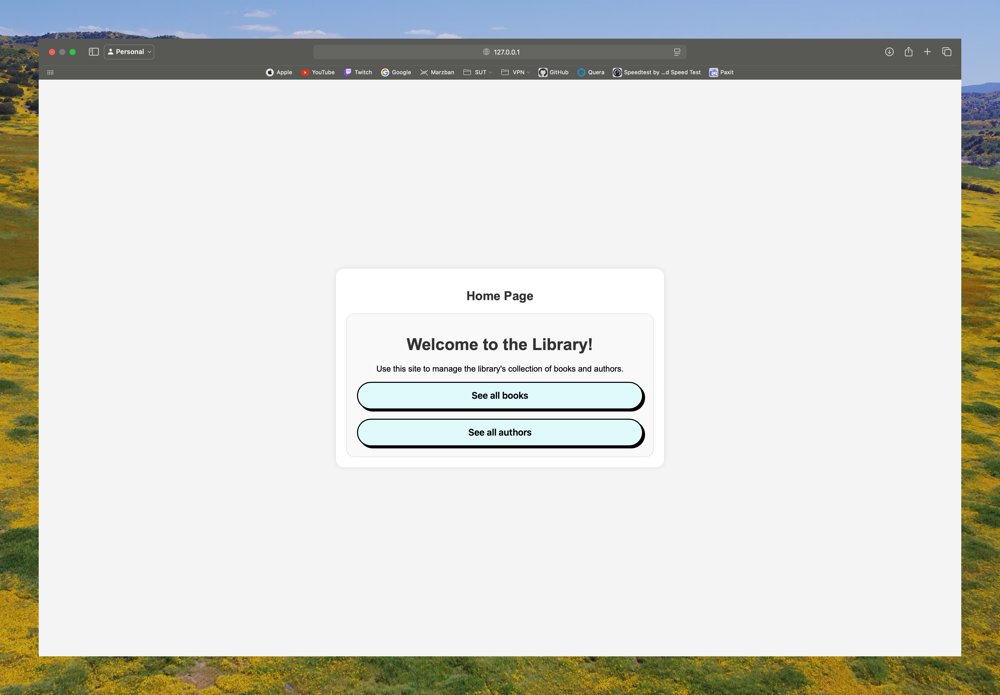

# Library with Django
<br />
<div align="left">
  <a href="https://github.com/mahanmi/library-django">
    
  </a>
  <br>
</div>

- [Library with Django](#library-with-django)
  - [Features](#features)
  - [Installation](#installation)
  - [Screenshots](#screenshots)
  - [Contributing](#contributing)
  - [License](#license)

Welcome to the Library with Django project. This project is a simple library management system that allows users to view, add, update, and delete books. The project is built using Django, a high-level Python Web framework that encourages rapid development and clean, pragmatic design.

## Features
- View all books
- Add a new book
- Update a book
- Delete a book
- Search for a book
- View all authors
- Add a new author
- Update an author
- Delete an author

## Installation
1. Clone the repository
```bash 
git clone
```
2. Install the required packages
```bash
pip install -r requirements.txt
```
3. Run the server
```bash
python manage.py runserver
```
4. Open the browser and go to http://localhost:8000/

## Screenshots
- Home Page

- Book List

- Add Book


## Contributing
Contributions are welcome! Please feel free to submit a Pull Request.

## License
This project is licensed under the MIT License - see the [LICENSE](LICENSE) file for details.
